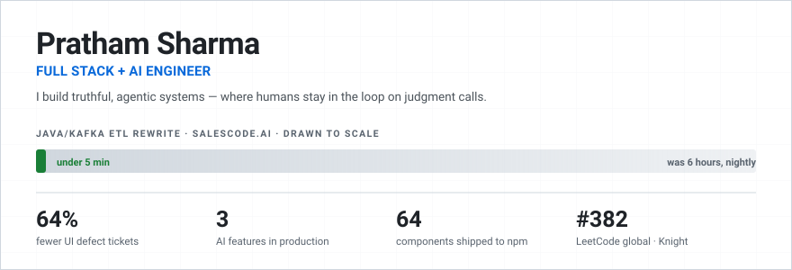

<picture>
  <source media="(prefers-color-scheme: dark)" srcset="assets/hero-dark.svg">
  
</picture>

---

## The thing I'm most proud of is a feature that says no

I built a resume tailor that rewrites my CV for each job I apply to. The hard part wasn't the rewriting — it was the **truthfulness gate**, which blocks the model from adding any skill I can't actually claim. It has refused to put `weaviate`, `chroma` and `hugging face` on my resume, because I haven't used them, even when the ATS scorer wanted them and the score would have gone up.

That is the whole thesis. Models are happy to overclaim on your behalf. The engineering worth doing is the part that stops them, and keeps a human on the judgment call.

Same idea, shipped at work: **AI Review** and **Smart Extraction** at Leegality pull structured fields out of contracts and validate them against rulesets — then capture every reviewer correction as labelled data and feed it back into internal fine-tuning. The reviewer stays the authority; the model gets better from being overruled.

---

## Where I've done it

**Leegality** — Software Engineer. Shipped 3 AI features into a live eSigning product — Lee AI (a RAG support assistant), AI contract review, and smart extraction — with concurrency-safe bulk pipelines behind them. Owned a design-system migration across 3 repos ahead of a Series-B pitch — 11 PRs, **64% fewer UI inconsistency tickets**.

**Salescode.ai** — Owned the Java microservices on AWS behind an enterprise CPG sales platform serving **1.2M+ users across 18+ countries**. Rewrote KPI computation as a multithreaded Java batch job, replacing scheduled stored procedures: a nightly run went from **6 hours to 5 minutes** (that's the bar in the header, drawn to scale). Built the Kafka-fed reporting service behind **65+ CPG brands**.

- 🎓 B.Tech IT · GGSIPU · **9.4 / 10**
- ⚔️ LeetCode **Knight** · 857 solved · best rank **#382 global**
- 📦 `@pratham7711/ui` on npm · **64 accessible components** · 50 design tokens

---

## Stack

**Frontend** `React` `TypeScript` `Next.js` `Tailwind CSS` `Framer Motion`

**Backend & AI** `Java` `Spring Boot` `Node.js` `FastAPI` `LangChain` `Pinecone` `PostgreSQL`

**Infra & Tooling** `Docker` `Kafka` `WebSockets` `Vercel` `Railway`

---

## Projects

| Project | Description | Stack | Links |
|---|---|---|---|
| **job-copilot** | The resume tailor above — 14 ATS vendor profiles, BM25 + local embeddings, and the truthfulness gate that refuses to invent skills | Node.js · Playwright · Ollama · Chrome extension | [Code](https://github.com/pratham7711/job-copilot-public) |
| **DocMind AI** | RAG-powered PDF chat — upload any doc, ask questions in plain English | Next.js · FastAPI · LangChain · Pinecone · Gemini | [Code](https://github.com/pratham7711/docmind-ai) |
| **Collabboard** | Real-time collaborative whiteboard with live presence and drawing tools | React · Socket.io · Fabric.js · Zustand | [Live](https://collabboard-phi.vercel.app) · [Code](https://github.com/pratham7711/collabboard) |
| **Shopwave** | Full-featured e-commerce storefront with Stripe checkout | React · TypeScript · Stripe · Zustand · Vite | [Code](https://github.com/pratham7711/shopwave) |
| **StreamDash** | Real-time event dashboard — live metrics, WebSocket feed, system health | React · Node.js · WebSockets · Recharts | [Code](https://github.com/pratham7711/streamdash) |
| **DevPulse** | GitHub analytics dashboard — repos, commits, stars, activity at a glance | React · GitHub API · Recharts · React Router | [Code](https://github.com/pratham7711/devpulse) |
| **@pratham7711/ui** | Design system — 64 accessible, themeable React components, published to npm | React · TypeScript · Vite · Storybook | [Live](https://pratham-ui.vercel.app) · [Code](https://github.com/pratham7711/prathamuio) |

---

*Open to global opportunities · prathamsharma7711@gmail.com*

